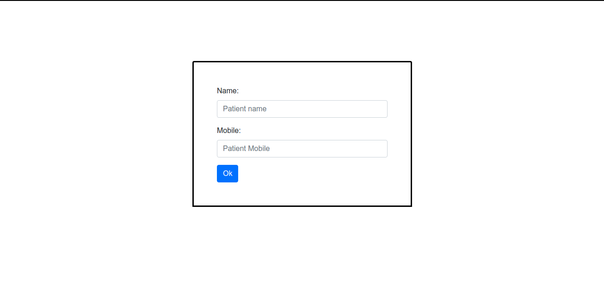
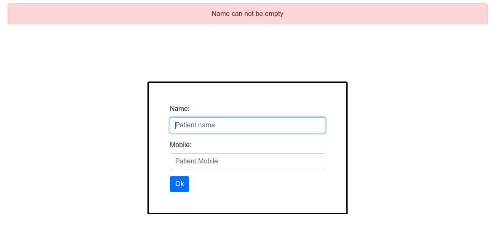
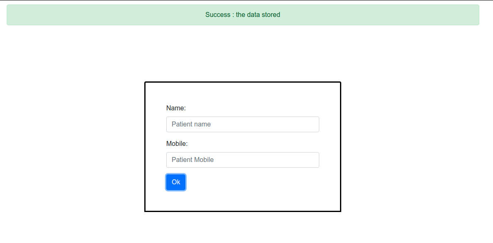
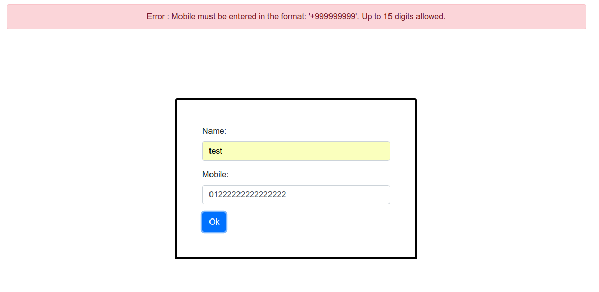
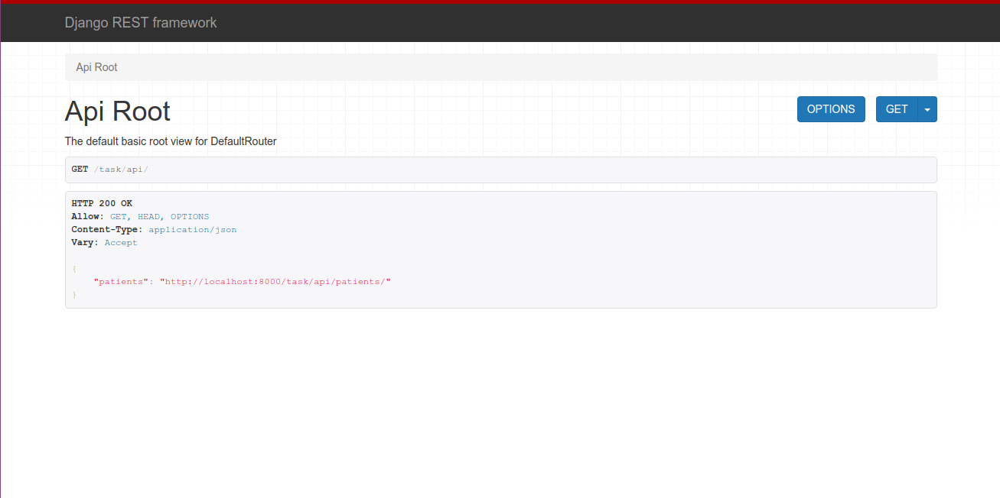
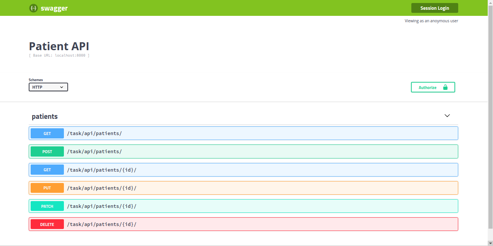

# Django-Task
Use django swagger Api ( Django Rest API ) for making test page to add patient <br/>
You have three models : <br/>
# Patient <br/>
name - mobile
# Visit
datatime - patient_id => M2O - price<br/>
# Order
visit_id => M2O , price <br/>
Test page contain Name, mobile and ok button <br/>

# Proof of concept for test page for

```
/task 
```
<br/>

<br/>

<br/>

<br/>

<br/>

<br/>

<br/>

<br/>


# Proof of concept for Django REST framework for 

```
/task/api/ 
```
<br/>

<br/>


# Proof of concept for swagger-ui for

```
/task/swagger-ui 
```

<br/>


